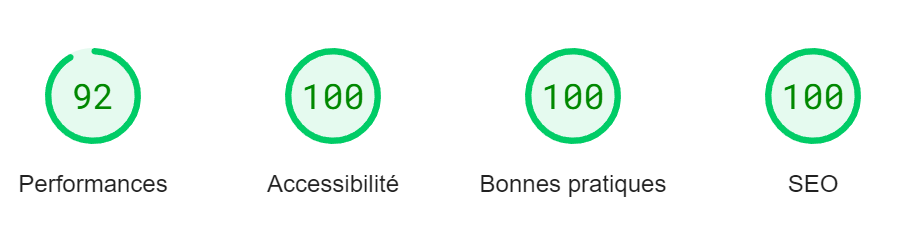

Mise en Situation:
Je suis développeur freelance et je décidez de proposer mes services d’optimisation SEO à de nouveaux clients. 
Parmi mes prospects, il y a le site de Nina Carducci, une photographe dont m'a parlé l’un de mes amis.
Mon objectif est de debugger et d'optimiser le site de Nina grace à différents outils pour améliorer son référencement.

Audits LightHouse et Wave avant optimisation:

Audits LightHouse et Wave après optimisation:

